## 1.1 Introduction

Localization involves making the robot know where it is in the environment. Mapping involves building geometric structure of the environment using sensors like LiDAR and RGB cameras. By the end of 8-weeks internship localization was done using Extended Kalman Filter and simultaneous Mapping was done using Iterative Closest Point algorithm. Results included the differential drive mobile robot navigating itself towards the goal position while avoiding obstacles using an Artificial Potential Field.

## 2.1 TurtleBot3 Burger

TurtleBot3 Burger is an open-source mobile robot designed for education, research, and robotics development. It is developed by ROBOTIS in collaboration with the Open Source Robotics Foundation (OSRF) and is widely used for learning Robot Programming.

### 2.1.1 Specifications

It is a differential drive equipped with:

1. 2D LiDAR
2. Wheel encoders
3. IMU
4. Raspberry Pi 4B
5. OpenCR controller

<p align="center">
  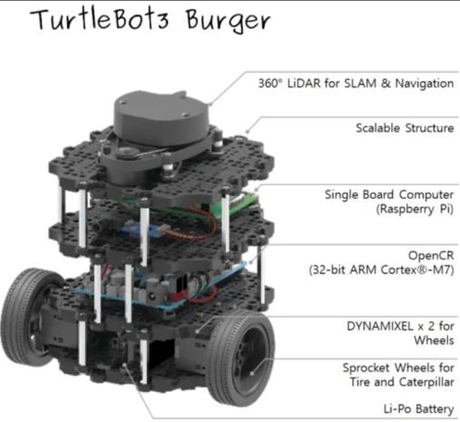
  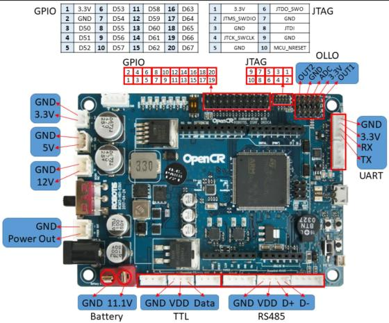
</p>
<p align="center"><em>Figure 1 - TurtleBot3 &nbsp;&nbsp;&nbsp;&nbsp; Figure 2 - OpenCR</em></p>

It can travel at a maximum speed of ~0.22 m/s linear speed and ~2.84 rad/s maximum angular velocity. Raspberry Pi acts as main computer and OpenCR controller is used for motor and sensor management.

## 3.1 Odometry

Odometry involves localizing the mobile robot's pose using movement of its wheels. The angular velocity of the wheels obtained from wheel encoders to inform where the robot is.

Consider the differential drive mobile robot as a rigid body in 2D plane:

<p align="center">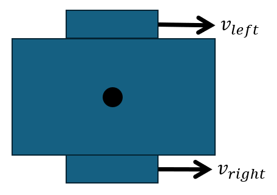</p>
<p align="center"><em>Figure 3</em></p>

As we know velocity of two points on the rigid body, we can determine the velocity of every point on the rigid body as shown in figure-4. But we are more interested in the Center of Mass as shown in figure-5.

<p align="center">
  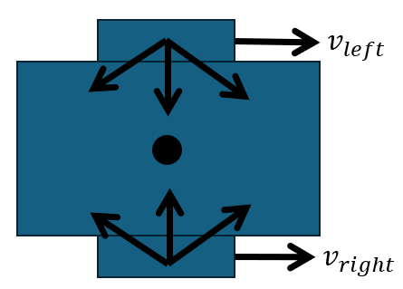
  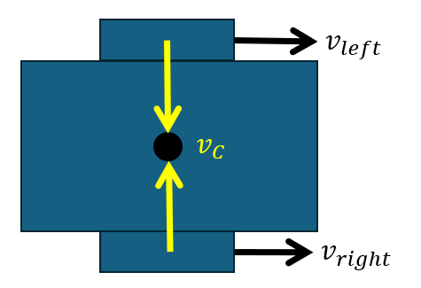
  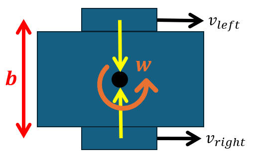
</p>
<p align="center"><em>Figure 4 &nbsp;&nbsp;&nbsp;&nbsp; Figure 5 &nbsp;&nbsp;&nbsp;&nbsp; Figure 6</em></p>

$$v_C = v_L + w \times r_L$$

$$v_C = v_R + w \times r_L$$

$$2v_C = v_L + v_R + w \times (r_L \times r_R)$$

$$v_C = \frac{v_L + v_R}{2}$$

Using simple geometry we can obtain linear and angular velocities in the cartesian plane:

$$
\dot{\boldsymbol{x}} = \begin{pmatrix}\dot{x}\\ \dot{y}\\ \dot{\theta}\end{pmatrix} =
\begin{pmatrix}\cos(\theta) & -\sin(\theta) & 0
\\ \sin(\theta) & \cos(\theta) & 0
\\ 0 & 0 & 1\end{pmatrix}
\begin{pmatrix}v\\ 0\\ w\end{pmatrix}
$$

And then use the forward Euler rule to get position of mobile robot w.r.t the origin where it started moving. With sampling $\Delta t$:

$$x_{k+1} = x_k + v_k \Delta t \cos\left(\theta_k + \frac{w_k \Delta t}{2}\right)$$

$$y_{k+1} = y_k + v_k \Delta t \sin\left(\theta_k + \frac{w_k \Delta t}{2}\right)$$

$$\theta_{k+1} = \theta_k + w_k \Delta t$$

Because of integration every measurement is expressed in a fixed frame. Let the fixed frame be $\{W\}$ and the moving frame be $\{B\}$ then we have the following discrete state space model of differential drive robot odometry:

$$^{W}x_{k+1} = {^{W}x_k} + v_k \Delta t \cos\left(^{W}\theta_k + \frac{w_k \Delta t}{2}\right)$$

$$^{W}y_{k+1} = {^{W}y_k} + v_k \Delta t \sin\left(^{W}\theta_k + \frac{w_k \Delta t}{2}\right)$$

$$^{W}\theta_{k+1} = {^{W}\theta_k} + w_k \Delta t$$

<p align="center">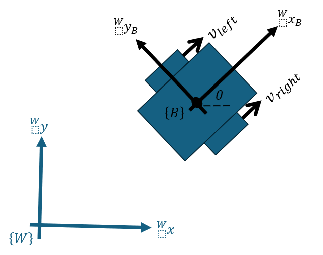</p>
<p align="center"><em>Figure 7</em></p>

### 3.1.1 Problems with Odometry

As we are integrating velocities to get position, any noise in wheel encoders is likely to accumulate. Also wheels can go little more further because of the slip on the floor or get slowed down because of rough path but the odometry model will still predict the robot to be moving with steady rate. This phenomenon of wheel slippage and accumulation of errors is also called Dead Reckoning in literature. So odometry alone is not a reliable estimate of robot's pose and we will need pose estimate from other sources.

## 4.1 Mapping using 2D LiDAR

Light Detection and Ranging (LiDAR) is a sensor that returns distance from obstacles using light.

Every measurement we get from the 2D LiDAR is in polar coordinates and is with respect to the LiDAR's frame. To make a map we would like to transform the LiDAR's measurements to cartesian and express them in the world. The accumulated x-y LiDAR points will serve as a map which can help the mobile robot localize itself in it. The following 2D map of the lab was created:

<p align="center">
  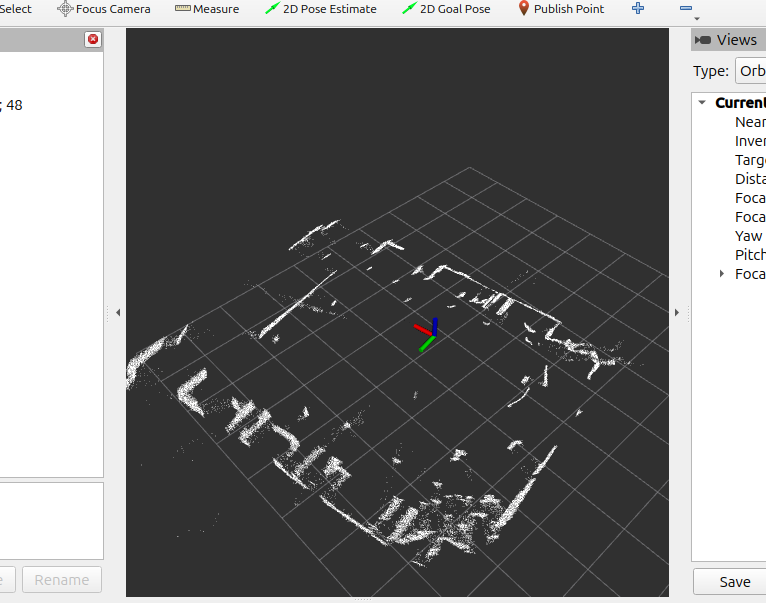
  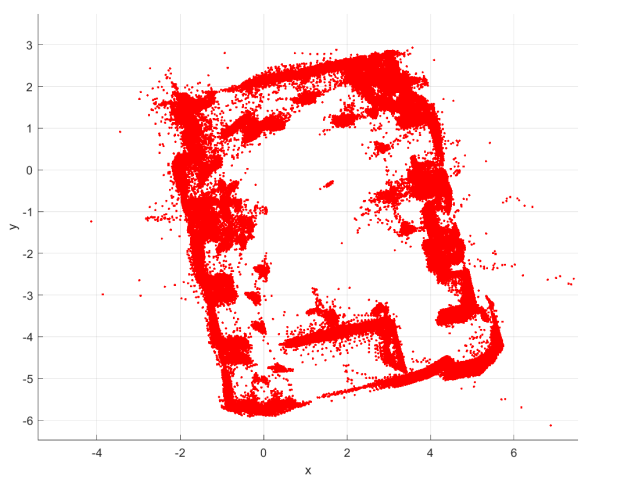
</p>
<p align="center"><em>Figure 8 - Map of the Lab in which I was working &nbsp;&nbsp;&nbsp;&nbsp; Figure 9 - Map</em></p>

As we load the map, shown in Figure-8 and Figure-9, it appears that it is away from the scan, shown in Figure-10. This happens when the initial pose of the robot is not in the map's origin and so the map needs to be transformed to where the robot is located.

<p align="center">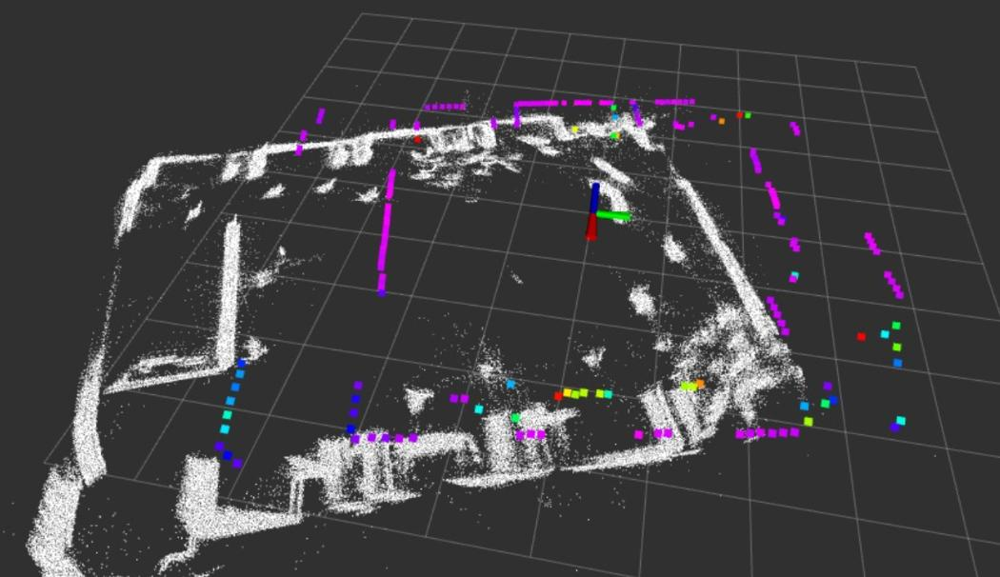</p>
<p align="center"><em>Figure 10 - Map or scan needs transformation</em></p>

If every x-y point on the map, w.r.t the world frame, is represented by a vector $\boldsymbol{p}$ then the map can be transformed using the initial pose of the robot. The initial pose includes a rotation matrix $R$ and scaling by translation vector $\mathbf{t}$.

$$\boldsymbol{p}_{map} = R^{T}(\boldsymbol{p}_{map} - \boldsymbol{t})$$

Following are the results:

<p align="center">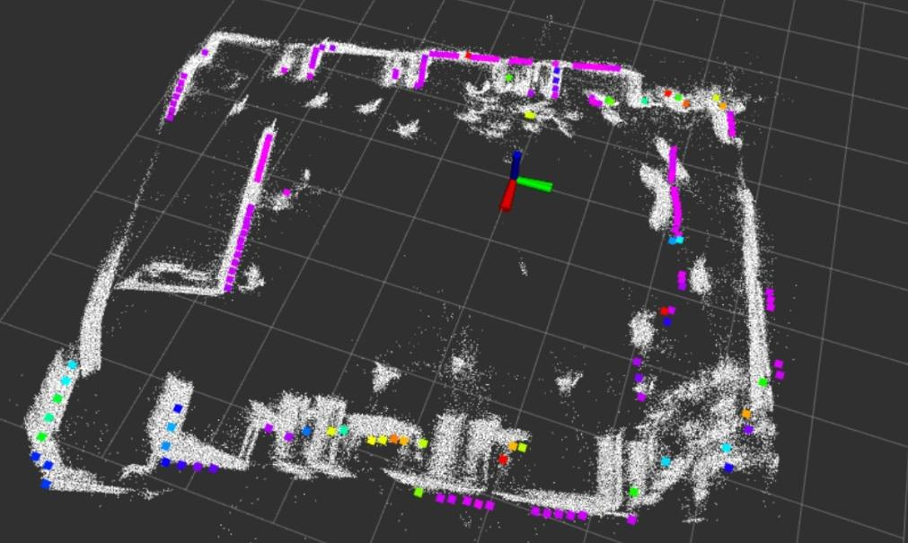</p>
<p align="center"><em>Figure 11 - Transformed map using initial pose</em></p>

So **effectively here I am transforming the map to match the scan.** To transform the scan instead, the following transform can be used on scan points.

$$\boldsymbol{p}_{scan} = t + R\. \boldsymbol{p}_{scan}$$

### 4.1.1 Using Iterative Closest Point Algorithm (ICP)

If $\{P\}$ is the previous scan and $\{Q\}$ is the next scan, then scan $\{Q\}$ looks little deviated because of LiDAR noise as shown in Figure-12. If this deviation is not taken into account, the drift continues to accumulate and moves the scan away from the map.

<p align="center">
  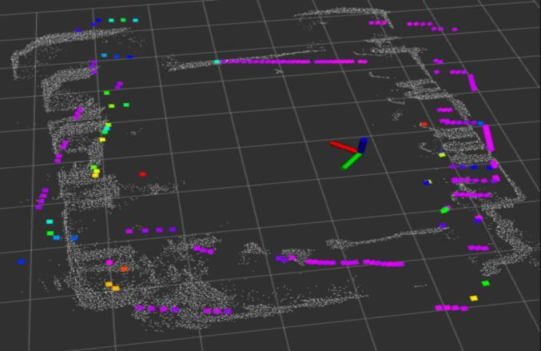
  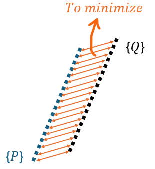
</p>
<p align="center"><em>Figure 12 - The map drifts so it needs recursive correction &nbsp;&nbsp;&nbsp;&nbsp; Figure 13 - Task of ICP algorithm</em></p>

ICP (Iterative Closest Point) is a point-cloud registration algorithm introduced by Paul J. Besl and Neil D. McKay in 1992.[^1]

[^1]: Paul J. Besl and Neil D. McKay, "A Method for Registration of 3-D Shapes," *IEEE Transactions on Pattern Analysis and Machine Intelligence (PAMI)*, Vol. 14, No. 2, pp. 239–256, February 1992.

The ICP algorithm finds the transformation (rotation matrix R and translation vector t) such that we can transform the current scan to the previous scan. This is an optimization problem, and it turns out that the optimal rotation matrix between the consecutive scans can be found by the covariance between associated points:

$$K = \frac{1}{n}\sum_{j=1}^{n}(p_s^{(j)} - \mu_s)(q_s^{(j)} - \mu_s)^T$$

After obtaining $K$ we can get rotation between the consecutive scans using Singular Value Decomposition of $K$:

$$USV^T = K$$

If we ignore the scaling, then rotation matrix $R$ is:

$$^{P}R_Q = UV^T$$

To ensure that $R \in SO(2)$ the following relation is the most often used:

$$^{P}R_Q = U\begin{pmatrix}1 & 0\\ 0 & \det(U)\det(V)\end{pmatrix}V^T$$

And translation is:

$$^{P}t_Q = q_s - {^{P}R_Q}\,p_s$$

If the purpose is to transform the scan to match the map, then the scan points are transformed using the following relation (the superscript + means current scan and − means previous scan):

$$p_{scan}^{+} = {^{P}R_Q}\,p_{scan}^{-} + {^{P}t_Q}$$

If the purpose is to transform the map to match the scan then the map points are transformed using the following relation (the superscript + means current map and − means previous map):

$$p_{map}^{+} = {^{P}R_Q}^{T}(p_{map}^{-} - {^{P}t_Q})$$

In the results I transformed the map.

### 4.1.2 Data Association

Before implementing ICP algorithm, the algorithm should know which scan point correspond to which map point.

Given scan points $S = \{s_i\}_{i=1}^{N}$ and map points $M = \{m_j\}_{m=1}^{M}$ then correspondence for each scan point is:

$$j_i^{*} = \arg\min_{j}\lVert m_j - s_i \rVert^{2}$$

Then the correspondences are: $m_i = m_{j_i^{*}}$

<p align="center">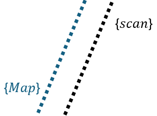</p>
<p align="center"><em>Figure 14</em></p>

### 4.1.3 Estimating Pose using ICP

From above after estimating $^{P}R_Q$ and $^{P}t_Q$ we can get $^{P}T_Q = \begin{pmatrix}^{P}R_Q & ^{P}t_Q\\ 0 & 1\end{pmatrix}$. If we have $^{W}T_P$ from another source (e.g. odometry) we can obtain the pose of the robot using the following relation:

$$^{W}T_Q = {^{W}T_P}\,{^{P}T_Q}$$

<p align="center">
  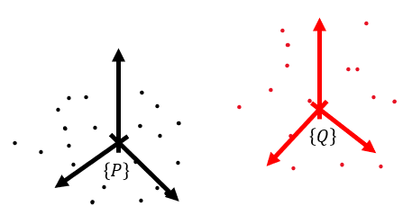
  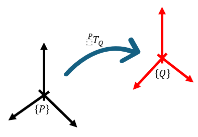
</p>
<p align="center"><em>Figure 15 - Previous scan P and current scan Q &nbsp;&nbsp;&nbsp;&nbsp; Figure 16 - Transformation between</em></p>

<p align="center">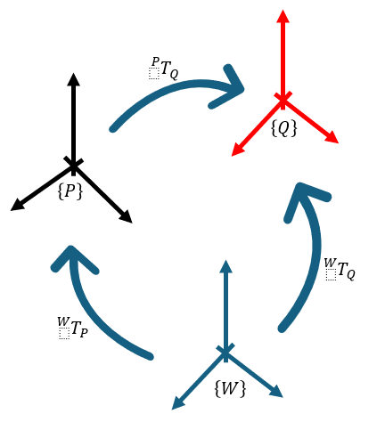</p>
<p align="center"><em>Figure 17 - Estimating pose using ICP</em></p>

## 5.1 Navigation and Obstacle Avoidance using Artificial Potential Field

Artificial Potential Field (APF) was first introduced by Oussama Khatib in 1986.[^2] This involved modeling the robot as a moving particle and the goal position generates an attractive potential, while obstacle generates repulsive potential.

[^2]: O. Khatib, "Real-Time Obstacle Avoidance for Manipulators and Mobile Robots," *The International Journal of Robotics Research*, 5(1), 90–98, 1986. DOI: 10.1177/027836498600500106

For obstacle avoidance and navigation towards the goal a custom Potential Field is designed that becomes the control law of the robot. The goal is to design:

$$U(q) = U_{att}(q) + U_{rep}(q)$$

Where $q$ contains x-y coordinates of the robot.

We can obtain the force of attraction and repulsion by taking negative gradients of these fields:

$$F(q) = -\nabla U_{att}(q) - \nabla U_{rep}(q)$$

### 5.1.1 Attractive Field

Take $q$ as position of robot and $q_{goal}$ as the goal position then the straightforward attractive force can be the distance squared between $q$ and $q_{goal}$ multiplied by the tunable gain $k_{att}$.

$$U_{att}(q) = \frac{1}{2}k_{att}\rho_{goal}^{2}(q) = \frac{1}{2}k_{att}\lVert q - q_{goal}\rVert^{2}$$

$$\nabla U_{att}(q) = k_{att}\rho_{goal}(q)\nabla\rho_{goal}(q) = \frac{1}{2}k_{att}(q - q_{goal})$$

For the correct attractive potential $U_{att}$ we set the following criterions:

1. It should go to zero when it reaches the desired position.
2. It should stay bounded as target position goes to infinity.

It is observed that the above attractive potential can go to infinity if the distance between $q$ and $q_{goal}$ was infinity which could force the robot to travel at infinity speed. So the simplest attractive potential does not obey the 2nd criterion. Also we don't want to clip the forces to zero at desired position because that can introduce discontinuities. What is really need is to get a linear relation, up to some threshold, when the robot is approaching close to goal it stops slowly while also appreciating continuity in the set bounds. That is why we use quadratic function in the attractive field equation.

$$
U_{att} =
\begin{cases}
\dfrac{1}{2}k_{att}\lVert q - q_{goal}\rVert^{2} & : \lVert q - q_{goal}\rVert \le d \\[6pt]
d\,k_{att}\lVert q - q_{goal}\rVert - \dfrac{1}{2}k_{att}d^{2} & : \lVert q - q_{goal}\rVert > d
\end{cases}
$$

$$
\nabla U_{att} =
\begin{cases}
\dfrac{1}{2}k_{att}(q - q_{goal}) & : \lVert q - q_{goal}\rVert \le d \\[6pt]
\dfrac{d\,k_{att}(q - q_{goal})}{\lVert q - q_{goal}\rVert} & : \lVert q - q_{goal}\rVert > d
\end{cases}
$$

Such that the gradient always show the following relation:

<p align="center">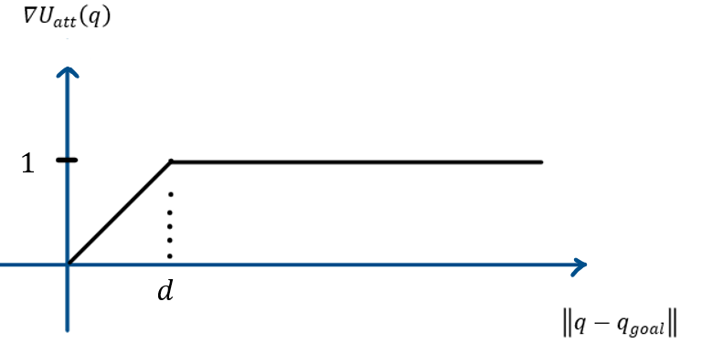</p>
<p align="center"><em>Figure 18 - Required relation for attractive gradient</em></p>

$U_{att}$ is a global field, meaning it will act on the robot from anywhere.

### 5.1.2 Repulsive Potential Field

The goal of repulsive potential field $U_{rep}(q)$ is to keep the particle (robot) away from the obstacle (detected from the LiDAR scan). We require the repulsive force from the obstacle to be larger as particle (robot) comes closer.

Like $U_{att}$ is global field, we want $U_{rep}$ local such that it acts on the robot only when the robot is near the obstacle up to some threshold.

$$
U_{rep} =
\begin{cases}
\dfrac{1}{2}k_{rep}\left(\dfrac{1}{\rho_b(q)} - \dfrac{1}{\rho_0}\right)^{2} & : \rho_b(q) \le \rho_0 \\[6pt]
0 & : \rho_b(q) > \rho_0
\end{cases}
$$

Where $\rho_0$ is the region of influence and $\rho_b(q)$ is the point on the obstacle that is closest to the robot. When $\rho_b(q)$ is close to zero then $U_{rep}$ is infinity. We drop $U_{rep} = 0$ after $\rho_b(q) > \rho_0$. The gradient of repulsive potential is the following:

$$
\nabla U_{rep} =
\begin{cases}
\dfrac{1}{2}k_{rep}\left(\dfrac{1}{\rho_b(q)} - \dfrac{1}{\rho_0}\right)\dfrac{\nabla\rho_b(q)}{\rho_b(q)^{2}} & : \rho_b(q) \le \rho_0 \\[6pt]
0 & : \rho_b(q) > \rho_0
\end{cases}
$$

Where,

$$\nabla\rho_b(q) = \frac{q - b}{\lVert q - b\rVert}$$

### 5.1.3 Law of Control

The following block diagram shows the structure of how the APF node in ROS2 will work. APF node updates its pose using Odometry but it can also be done using state estimation algorithm like Extended Kalman Filter.

<p align="center">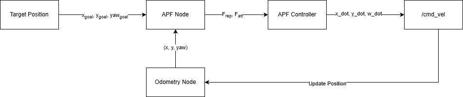</p>
<p align="center"><em>Figure 19 - Process diagram of APF</em></p>

We want the forces to become law of robot movement. After defining the force $F(q) = -\nabla U_{att}(q) - \nabla U_{rep}(q)$ we can define error terms using Odometry (or any other localization algorithm) and use proportional controller to update the position of robot. For better performance PD or PID controller can also be incorporated if the robot moves in an unstable way.

<p align="center">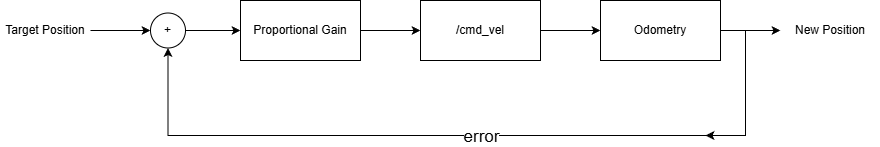</p>
<p align="center"><em>Figure 20 - Controller to move the robot</em></p>

### 5.2 Results

The algorithm was tested by setting a target position which moved the robot, in a stable way, towards the goal while avoiding the obstacle in the front. The results are given below:

<p align="center">
  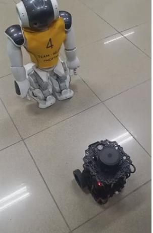
  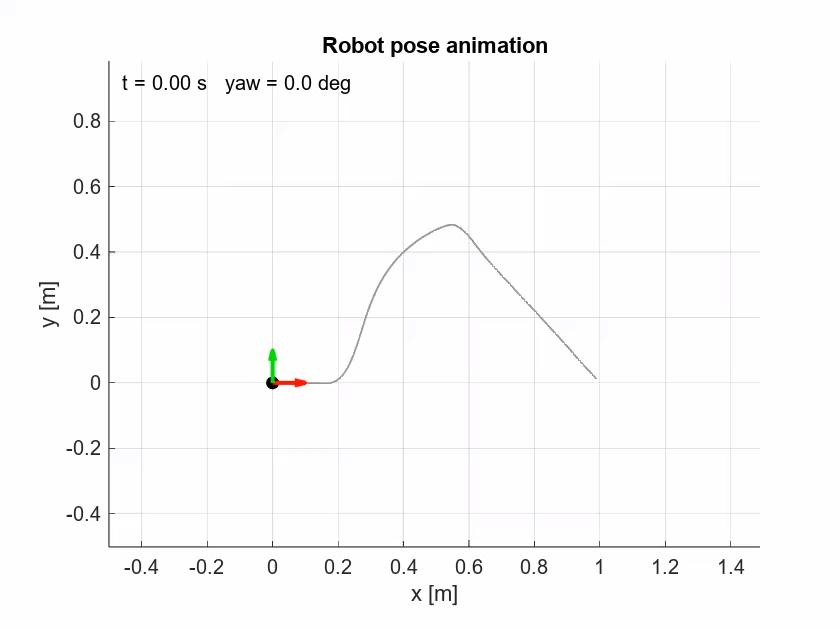
</p>
<p align="center"><em>Figure 21 – Results &nbsp;&nbsp;&nbsp;&nbsp; Figure 22 – The robot reaches its goal position (1,0) while avoiding the obstacle</em></p>

<p align="center">
  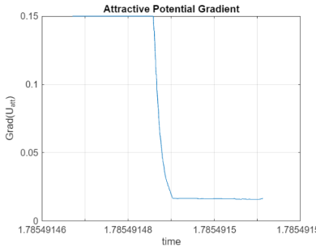
  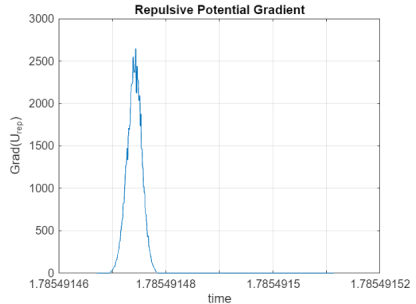
  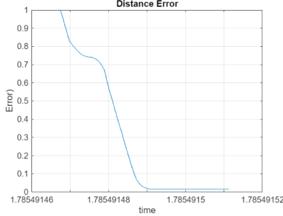
</p>
<p align="center"><em>Figure 23 - Attractive field &nbsp;&nbsp;&nbsp;&nbsp; Figure 24 - Repulsive field &nbsp;&nbsp;&nbsp;&nbsp; Figure 25 - Distance error</em></p>

## 6.1 Extended Kalman Filter

### 6.1.1 Minimum Mean-Squared Estimation

According to the minimum Mean-Squared estimator optimization, the best estimate of the random variable (or vector) $X = x_i$ given some measurement $Y = y_j$ is given by $E[X \mid Y = y]$ where:

$$E(X \mid Y = y) = \sum_i x_i\, P(X = x_i \mid Y = y)$$

So conditional expectation involves also knowing the joint distribution $P(X = x_i \mid Y = y)$.

### 6.1.2 For Gaussian Distributions

For Gaussian vectors, estimating the joint $P(X = x_i \mid Y = y)$ becomes easier as the Gaussian distributions is represented by two parameters 1) mean and 2) variance. Conditional expectation and conditional covariance of gaussian vectors is:

$$E(x_k \mid y_k) = E(x_k) + Cov(x_k, y_k)\,Cov(y_k)^{-1}\big(y_k - E(y_k)\big)$$

$$P_k = Cov(x_k \mid y_k) = Cov(x_k) - Cov(x_k, y_k)\,Cov(y_k)^{-1}\,Cov(y_k, x_k)$$

### 6.1.3 Extended Kalman Filter

Given the discrete-time nonlinear state-space model representing some state:

$$x = \boldsymbol{f}(\boldsymbol{x}, \boldsymbol{u}) + \boldsymbol{w_k}\,, \quad \boldsymbol{w_k} \in \mathcal{N}(\boldsymbol{0}, \boldsymbol{Q_k})$$

Where $\boldsymbol{Q_k} = Cov(\boldsymbol{w_k})$ is the process noise covariance.

#### 6.1.3.1 Linearization

We first linearize $\boldsymbol{f}(\boldsymbol{x},\boldsymbol{u})$ on operating points: $x_0$ and $u_0$.

$$f(x_k, u_k) \approx f(x_0, u_k) + \left.\frac{\partial f}{\partial x_k}\right|_{x_0,u_k}(x_k - x_0)$$

#### 6.1.3.2 Prediction Step

Using MMSE the best estimate of $x_k$ is given by conditional expectation. It turns out that the predicted state is just the measurement obtained at operating points.

$$\hat{x}_{k+1|k} = f(x_k, u_k)$$

In order to propagate uncertainty we also need the covariance of the predicted state.

$$P_{k+1|k} = F_k\,E\big((x - \hat{x}_k)(x - \hat{x}_k)^T \mid Y_k\big)\,F_k^T + E(w_k w_k^T \mid Y_k)$$

Using the conditional covariance of gaussian it turns out that the covariance of predicted state is:

$$P_{k+1|k} = F_k P_k F_k^T + G_k Q_k G_k^T$$

Where:

- $F_k = \dfrac{\partial f}{\partial x_k}$ is the Jacobian w.r.t state.
- $G_k = \dfrac{\partial f}{\partial u_k}$ is the Jacobian w.r.t input.

#### 6.1.3.3 Correction Step

Because the predicted state has flaws, the EKF requires a measurement model that will be taken as reference to correct the predicted state:

$$y_{k+1} = h(x_{k+1}, u_{k+1}) + v_{k+1}$$

Where $v_{k+1} \in \mathcal{N}(\boldsymbol{0}, \boldsymbol{M_k})$ is the measurement noise and $\boldsymbol{M_k}$ measurement noise covariance.

We also linearize $h(x_{k+1}, u_{k+1})$ and find that:

$$y_{k+1} = C\,x_{k+1} + v_{k+1}$$

Where $C = \left.\dfrac{\partial h}{\partial x_k}\right|_{x_{k+1|k}, u_{k+1}}(x_{k+1} - x_{k+1|k})$.

Using the previous result we use $\hat{x}_{k+1|k}$, $P_{k+1|k}$ to compute $\begin{pmatrix}\hat{x}_{k+1}\\ P_{k+1}\end{pmatrix}$.

For that we wish to compute the joint distribution:

$$
\begin{pmatrix}x_{k+1}\\ y_{k+1}\end{pmatrix}\Big|Y_k \sim
\mathcal{N}\left(
\begin{bmatrix}E(x_{k+1}\mid Y_k)\\ E(y_{k+1}\mid Y_k)\end{bmatrix},
\begin{bmatrix}Cov(x_{k+1},x_{k+1}\mid Y_k) & Cov(x_{k+1},y_{k+1}\mid Y_k)\\ Cov(y_{k+1},x_{k+1}\mid Y_k) & Cov(y_{k+1},y_{k+1}\mid Y_k)\end{bmatrix}
\right)
$$

To update expected value of state we use conditional expectation (like in the prediction step):

$$
\begin{bmatrix}E(x_{k+1}\mid Y_k)\\ E(y_{k+1}\mid Y_k)\end{bmatrix} = E(x_{k+1}, y_{k+1}\mid Y_k)
$$

$$
E(x_{k+1}, y_{k+1}\mid Y_k) = E(x_{k+1}\mid Y_k) + Cov(x_{k+1}, y_{k+1}\mid Y_k)\cdot Cov(y_{k+1}\mid Y_k)^{-1}\cdot\big(y_{k+1} - E(y_{k+1}\mid Y_k)\big) = \hat{x}_{k+1\mid k+1}
$$

Where:

- $E(x_{k+1}\mid Y_k) = \hat{x}_{k+1\mid k}$ — given by prediction step.
- $Cov(x_{k+1}, y_{k+1}\mid Y_k) = Cov(x_{k+1}, x_{k+1}\mid Y_k)\,C_{k+1}^T = P_{k+1\mid k}\,C_{k+1}^T$
- $Cov(y_{k+1}\mid Y_k)^{-1} = \big(C_{k+1}P_{k+1\mid k}C_{k+1}^T + Cov(v_{k+1})\big)^{-1}$
- $E(y_{k+1}\mid Y_k) = C_k\,\hat{x}_{k+1\mid k}$

We define the Kalman Gain $K_{k+1}$:

$$K_{k+1} = Cov(x_{k+1}, y_{k+1}\mid Y_k)\cdot Cov(y_{k+1}\mid Y_k)^{-1} = P_{k+1\mid k}C_{k+1}^T\big(C_{k+1}P_{k+1\mid k}C_{k+1}^T + Cov(v_{k+1})\big)^{-1}$$

Therefore, in the most simplistic way if the measurement model and state model predicted same values then the current state is equal to the predicted state. If they were not the same then the difference between $\big(y_{k+1} - E(y_{k+1}\mid Y_k)\big)$ is scaled by the Kalman gain $K_{k+1}$ and added to predicted state to provide the best estimate of the state:

$$\hat{x}_{k+1\mid k+1} = \hat{x}_{k+1\mid k} + K_{k+1}\big(y_{k+1} - E(y_{k+1}\mid Y_k)\big)$$

To be ready for the next time index we also need to propagate the covariance $P$ in the correction step:

$$P_{k+1\mid k+1} = P_{k+1\mid k} - P_{k+1\mid k}C_{k+1}^T\big(C_{k+1}P_{k+1\mid k}C_{k+1}^T + Cov(v_{k+1})\big)^{-1}C_{k+1}P_{k+1\mid k}$$

$$P_{k+1\mid k+1} = (I - K_{k+1}C_{k+1})\,P_{k+1\mid k}  $$

### 6.1.4 Filter Equations

#### 6.1.4.1 Odometry Prediction Model

We need to propagate uncertainty in Odometry using its state-space model. The uncertainty in odometry comes from wheel encoders.

The state-space model of odometry is:

$$
\dot{\boldsymbol{x}} = \begin{pmatrix}\dot{x}\\ \dot{y}\\ \dot{\theta}\end{pmatrix} =
\begin{pmatrix}\cos(\theta) & -\sin(\theta) & 0\\ \sin(\theta) & \cos(\theta) & 0\\ 0 & 0 & 1\end{pmatrix}
\begin{pmatrix}v\\ 0\\ w\end{pmatrix}
$$

$$
\begin{pmatrix}v\\ w\end{pmatrix} =
\begin{pmatrix}r_R/2 & r_L/2\\ r_R/2b & -r_L/2b\end{pmatrix}
\begin{pmatrix}\dot\varphi_R\\ \dot\varphi_L\end{pmatrix}
$$

Where:

- $r_R$ is radius of right wheel and $r_L$ is radius of left wheel.
- $\dot\varphi_R$ is angular velocity of right wheel and $\dot\varphi_L$ is angular velocity of left wheel.

Comparing the equations we get:

$$
\begin{pmatrix}\dot{x}\\ \dot{y}\\ \dot{\theta}\end{pmatrix} =
\begin{pmatrix}
\dfrac{r_R}{2}\cos\theta & \dfrac{r_L}{2}\cos\theta \\[6pt]
\dfrac{r_R}{2}\sin\theta & \dfrac{r_L}{2}\sin\theta \\[6pt]
\dfrac{r_R}{2b} & -\dfrac{r_L}{2b}
\end{pmatrix}
\begin{pmatrix}\dot\varphi_R\\ \dot\varphi_L\end{pmatrix}
$$

After performing forward Euler rule using sampling time $\Delta t$:

$$x_{k+1} = x_k + \Delta t\left(\dot\varphi_R\frac{r_R}{2}\cos\theta_k + \dot\varphi_L\frac{r_L}{2}\cos\theta_k\right)$$

$$y_{k+1} = y_k + \Delta t\left(\dot\varphi_R\frac{r_R}{2}\sin\theta_k + \dot\varphi_L\frac{r_L}{2}\sin\theta_k\right)$$

$$\theta_{k+1} = \theta_k + \Delta t\left(\dot\varphi_R\frac{r_R}{2b} - \dot\varphi_L\frac{r_L}{2b}\right)$$

The state-space is:

$$
f(x_{k+1}, u_k) =
\begin{pmatrix}
x_k + \Delta t\left(\dot\varphi_R\dfrac{r_R}{2}\cos\theta_k + \dot\varphi_L\dfrac{r_L}{2}\cos\theta_k\right) \\[8pt]
y_k + \Delta t\left(\dot\varphi_R\dfrac{r_R}{2}\sin\theta_k + \dot\varphi_L\dfrac{r_L}{2}\sin\theta_k\right) \\[8pt]
\theta_k + \Delta t\left(\dot\varphi_R\dfrac{r_R}{2b} - \dot\varphi_L\dfrac{r_L}{2b}\right)
\end{pmatrix}
$$

$$u_k = \begin{pmatrix}1 & 0\\ 0 & 1\end{pmatrix}\begin{pmatrix}\dot\varphi_R\\ \dot\varphi_L\end{pmatrix}$$

The Jacobians of state-space is:

$$
F_k = \frac{\partial f}{\partial x} =
\begin{pmatrix}
1 & 0 & -\Delta t\left(\dot\varphi_R\dfrac{r_R}{2}\sin\theta_k + \dot\varphi_L\dfrac{r_L}{2}\sin\theta_k\right) \\[8pt]
0 & 1 & \Delta t\left(\dot\varphi_R\dfrac{r_R}{2}\cos\theta_k + \dot\varphi_L\dfrac{r_L}{2}\cos\theta_k\right) \\[8pt]
0 & 0 & 1
\end{pmatrix}
$$

$$
G_k = \frac{\partial f}{\partial u} =
\begin{pmatrix}
\Delta t\dfrac{r_R}{2}\cos\theta_k & \Delta t\dfrac{r_L}{2}\cos\theta_k \\[8pt]
\Delta t\dfrac{r_R}{2}\sin\theta_k & \Delta t\dfrac{r_L}{2}\sin\theta_k \\[8pt]
\Delta t\dfrac{r_R}{2b} & -\Delta t\dfrac{r_L}{2b}
\end{pmatrix}
$$

Then covariance of odometry can be propagated using:

$$P_{k+1\mid k} = F_k P_k F_k^T + G_k Q_k G_k^T$$

#### 6.1.4.2 LiDAR Measurement Model

The LiDAR measurement model is required in the correction step of EKF.

$$\hat{x}_{k+1\mid k+1} = \hat{x}_{k+1\mid k} + K_{k+1}\big(y_{k+1} - E(y_{k+1}\mid Y_k)\big)$$

$E(y_{k+1}\mid Y_k) = C_k\,\hat{x}_{k+1\mid k}$ comes from odometry prediction above and $y_{k+1}$ is LiDAR measurement which comes from ICP algorithm. The ICP algorithm is estimating a member of $SE(2)$ with special properties.

$$^{W}T_Q = {^{W}T_P}\,{^{P}T_Q} \in SE(2)$$

Which is the reason why performing $\big(y_{k+1} - E(y_{k+1}\mid Y_k)\big)$ is not valid. The $\big(y_{k+1} - E(y_{k+1}\mid Y_k)\big)$ term must also be a member of $SE(2)$ group and the process proceeds towards treating Kalman Filter using Lie Algebra.

But for simplicity simpler measurement is assumed. Instead of $^{W}T_Q$ homogeneous transformation matrix we just obtain x-y position and yaw angle. Thus the measurement model of ICP pose estimation is:

$$
z_{meas} = C\begin{bmatrix}x_{icp}\\ y_{icp}\\ \theta_{icp}\end{bmatrix}
$$

Where the Jacobian $C$ is identity:

$$C = \begin{bmatrix}1 & 0 & 0\\ 0 & 1 & 0\\ 0 & 0 & 1\end{bmatrix}$$

Effectively the odometry and ICP algorithm estimates the same random variables and the resulting EKF is simpler.

As the Kalman Gain is:

$$K_{k+1} = P_{k+1\mid k}C_{k+1}^T\big(C_{k+1}P_{k+1\mid k}C_{k+1}^T + R\big)^{-1}$$

Where $R = Cov(v_{k+1})$ the covariance of measurement noise, better performance of Kalman Filter involve tuning the covariance matrix:

$$
R = \begin{pmatrix}\sigma_{xx} & 0 & 0\\ 0 & \sigma_{yy} & 0\\ 0 & 0 & \sigma_{\theta\theta}\end{pmatrix}
$$

Where $\sigma_{xx}$, $\sigma_{yy}$, and $\sigma_{\theta\theta}$ are variance of estimates of x-y position and yaw-angle.

- If we want EKF to trust a measurement less, we increase the variance of that measurement in $R$ matrix so that the corresponding Kalman gain is less for that measurement.
- If we want EKF to trust a measurement more, we decrease the variance of that measurement in $R$ matrix so that the corresponding Kalman gain is high for that measurement.

#### 6.1.4.3 Results

The first plot in Figure-26 shows the robot moving in a defined circular path, of which odometry gave good estimate. Since ICP algorithm doesn't work well for open environments, it gave bad estimates and also corrupted the EKF results. As a result we need to increase $\sigma_{xx}$ and $\sigma_{yy}$ and decrease $\sigma_{\theta\theta}$.

<p align="center">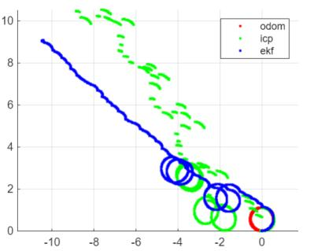</p>
<p align="center"><em>Figure 26</em></p>

After performing tuning the robot was set to move towards goal position using Artificial Potential Field and it was observed, shown in Figure-27, that the robot gets unstable at the goal position. Focusing on EKF results we see that the robot is now drifted EKF out of the map, because ICP was using odometry for guessing to converge to correct local minima.

<p align="center">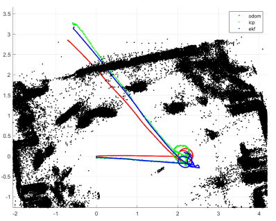</p>
<p align="center"><em>Figure 27</em></p>

After correcting the convergence problem in the ICP algorithm, improved results were observed in the EKF, shown in Figure-28. However, the robot occasionally became partially stuck or slipped while crossing the boundaries between floor tiles, causing the wheel odometry to provide inaccurate estimates of the robot's motion. In these cases, the EKF relied more heavily on the yaw-angle estimate obtained from ICP, resulting in a better overall state estimate. Nevertheless, the localization accuracy was still not sufficient for reliable performance.

<p align="center">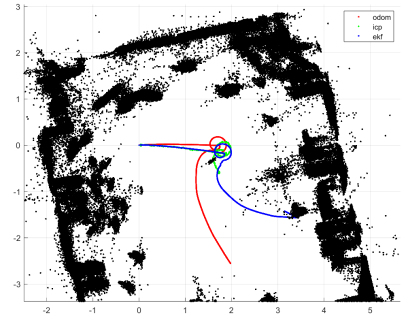</p>
<p align="center"><em>Figure 28</em></p>

### 6.2 Process Noise Covariance

Obtaining process noise covariance is one of the toughest part of implementing a Kalman Filter. Normally it can be tuned but it can also be experimentally estimated which is what I have done.

<p align="center">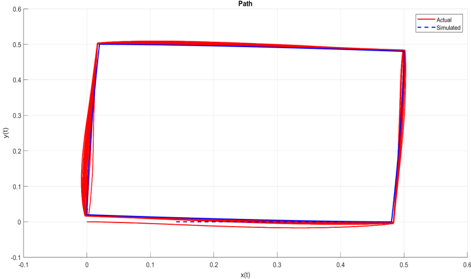</p>
<p align="center"><em>Figure 29</em></p>

The robot was commanded to travel a defined path in both real and simulator (Gazebo) after that we obtain residuals:

$$
e_k^{W} = \begin{bmatrix}\dot\varphi_L^{(k)}\\ \dot\varphi_R^{(k)}\end{bmatrix}_{ref} - \begin{bmatrix}\widehat{\dot\varphi}_L^{(k)}\\ \widehat{\dot\varphi}_R^{(k)}\end{bmatrix}
$$

<p align="center">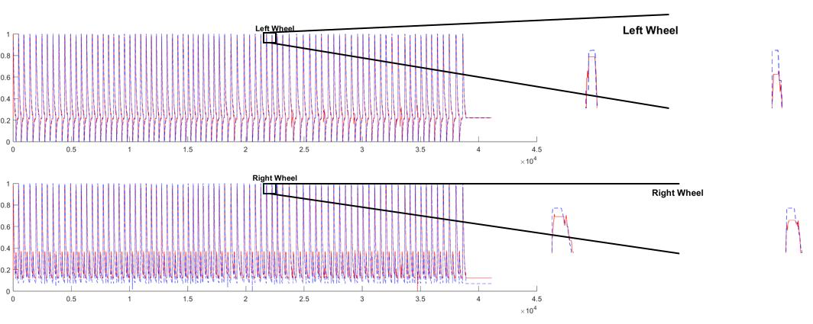</p>
<p align="center"><em>Figure 30</em></p>

Then covariance of residuals can be obtained:

$$\hat{Q}_W = \frac{1}{N-1}\sum_k e_k^{W}(e_k^{W})^T$$

The following result was obtained using MATLAB:

<p align="center">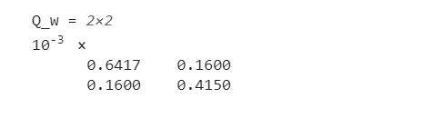</p>
<p align="center"><em>Figure 31 - Process noise covariance of odometry</em></p>

## 7.1 Deliverables

This work is easily available on GitHub: [https://github.com/huzaifa-tahir-40/slam](https://github.com/huzaifa-tahir-40/slam)

It has 5 packages,

`apf_pkg` starts the artificial potential field for navigation and obstacle avoidance.

```bash
ros2 launch apf_pkg apf_launch.launch.py
```

`lidar_pkg` starts lidar filtering, ICP algorithm for recursive map updates and pose estimation, and map loader for loading and updating the map.

```bash
ros2 launch lidar_odom lidar_pkg.launch.py
```

`odom_cmd` can command the robot to travel a path using either open-loop and closed-loop control. The following command will make robot start moving in a defined path (currently circle).

```bash
ros2 launch odom_cmd odom_log.launch.py
```

`ekf_pkg` starts Extended Kalman Filter localization, uses odometry, from `/odom` topic, and LiDAR reference for correction. There are two EKF nodes, one node uses pose reference from the ICP algorithm on the topic `/icp/pose` and the other EKF node compares LiDAR measurements in polar coordinates on a fixed frame with landmarks on the map in the correction step.

```bash
ros2 launch ekf_pkg ekf_pkg.launch.py
ros2 launch ekf_pkg ekf_pkg_map.launch.py
```

Because all packages work together to achieve the purpose, the `robot_bringup` package runs other packages simultaneously. Initial pose from RViz2 will need to be published to make things work.

```bash
ros2 launch robot_bringup bringup.launch.py
ros2 launch robot_bringup bringup_map.launch.py
ros2 launch robot_bringup bringup_cmd.launch.py
ros2 launch robot_bringup bringup_cmd_no_icp.launch.py
ros2 launch robot_bringup start_cmd.launch.py
```

## Conclusion

During the internship I highly focused on understanding the Kalman Filter and learning ROS2. Everything implemented throughout the internship was self-learned during the internship period and then implemented. Though EKF was not properly tuned by the end of internship, ROS bag has been created to keep improving the project.
